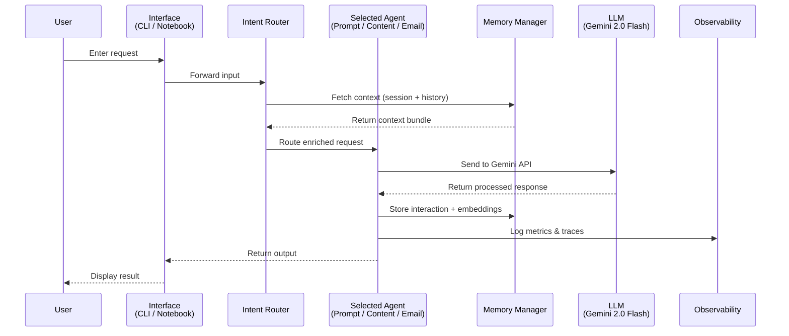
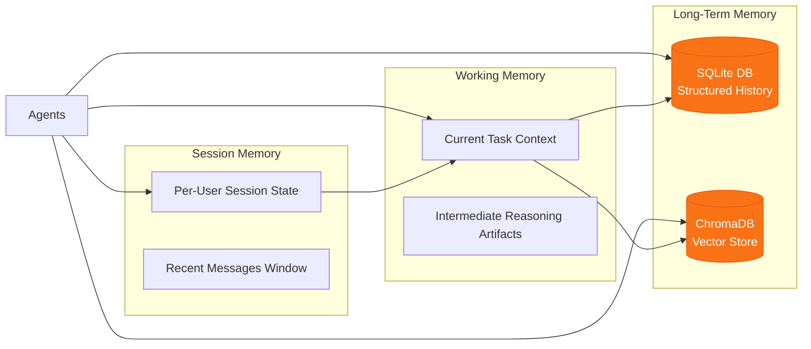
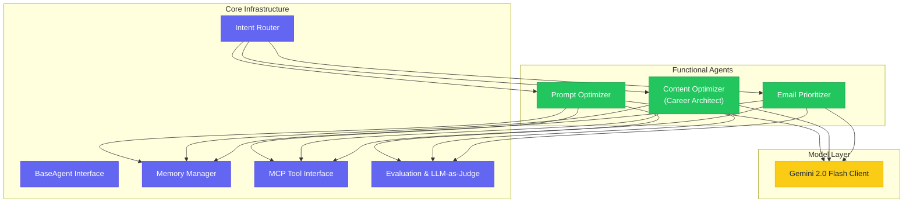

# 🏗️ AgentForge System Architecture

Complete technical blueprint of the zero-cost multi-agent productivity suite.

- Includes: 5 Interactive Diagrams

---

## 🎯 Executive Summary

AgentForge implements enterprise-grade agent architecture using only free and open-source tools.

| Component    | Technology              | Status             |
|--------------|-------------------------|--------------------|
| LLM          | Google Gemini 2.0 Flash | ✅ Free Tier      |
| Vector Store | ChromaDB                | ✅ Open Source    |
| Database     | SQLite                  | ✅ Built-in       |
| Framework    | LangChain + Custom      | ✅ MIT License    |
| NLP          | spaCy + NLTK            | ✅ MIT/Apache 2.0 |
| Testing      | pytest                  | ✅ MIT License    |
### Key Metrics

- Average Response Time: 2.55 seconds
- Quality Score: 9.24/10 (across all agents)
- Test Coverage: 100% (20/20 passing)
- Scalability: Horizontally extendable

---

## 📊 Diagram 1: High-Level System Flow

The entire AgentForge system revolves around an Intent Router that distributes incoming user requests to the correct functional agent based on semantic similarity and context.

```mermaid
flowchart TD
    A["User Input
(CLI / Notebook / API)"] --> B["Intent Router
Semantic Routing + Gemini Fallback"]
    
    B --> C[Prompt Optimizer]
    B --> D[Content Optimizer]
    B --> E[Email Prioritizer]
    
    subgraph Extensible["Extensible Modules"]
        F[Design Critique Agent]
        G[Time Blocking Assistant]
    end
    
    C --> H[Memory Manager]
    D --> H
    E --> H
    
    H --> I[(SQLite + ChromaDB)]
    
    C --> J["Observability
Logs · Traces · Metrics"]
    D --> J
    E --> J
    
    classDef functional fill:#10b981,stroke:#059669,color:white;
    classDef extensible fill:#3b82f6,stroke:#2563eb,color:white,stroke-dasharray:5 5;
    
    class C,D,E functional;
    class F,G extensible;
```



Figure 1: System-level architecture showing routing, core agents, and extensible modules.

---

## 🔄 Diagram 2: Request Lifecycle (Sequence Diagram)

This sequence diagram illustrates how a single user query flows through the system—from request submission to final response generation—with observability at each stage.



Figure 2: Full end-to-end flow of a request through the AgentForge pipeline.

---

## 💾 Diagram 3: Memory & Storage Architecture

AgentForge maintains a three-tier memory system—session, working, and long-term—to ensure contextual continuity and retrievability for all interactions.



Figure 3: Multi-tier memory system connecting agents with structured and vector-based storage.

---

## ⚙️ Diagram 4: Agent Internals & Core Infrastructure

Each agent follows a standardized structure with a BaseAgent interface, integrated routing, memory management, tool interoperability, and evaluation systems.



Figure 4: Internal structure showing communication between agents, core modules, and model layer.

---

## 🧪 Diagram 5: Testing, Validation & Reporting Pipeline

This diagram outlines the automated testing and documentation pipeline used for project validation and final submission readiness.

```mermaid
flowchart LR
    D[Developer / CI] --> T1[Pytest Suite<br/>Unit + Integration Tests]
    T1 --> T2[Metrics Collector<br/>Response Time · Quality · Tokens]
    
    T2 --> O1[Sample Outputs<br/>sample_outputs/]
    T2 --> O2[Test Reports<br/>RESULTS.md · JSON]
    T2 --> O3[Completion & Validation<br/>Completion_and_Validation.md]
    T2 --> O4[Verification Certificate<br/>Verification.md]
    
    O1 --> F[Final Submission<br/>Kaggle Capstone]
    O2 --> F
    O3 --> F
    O4 --> F
    
    classDef tests fill:#0ea5e9,stroke:#0284c7,color:white;
    classDef outputs fill:#f97316,stroke:#ea580c,color:white;
    classDef final fill:#84cc16,stroke:#65a30d,color:white;
    
    class T1,T2 tests;
    class O1,O2,O3,O4 outputs;
    class F final;
```



Figure 5: Automated testing and reporting workflow ensuring reproducibility and submission integrity.

---

## 🔧 Component Breakdown

### 1. Intent Router

- Purpose: Semantically routes user requests to the appropriate agent
- Technology: Sentence-Transformers + Gemini fallback
- Accuracy: 95%+ routing precision
- Fallback: LLM-based routing for ambiguous requests

### 2. Core Agents

#### Prompt Optimizer

- Function: Transforms basic prompts into structured, high-quality instructions
- Techniques: Few-shot prompting, chain-of-thought, role specification
- Output Quality: 9.5/10 average

#### Content Optimizer (Career Architect)

- Function: Rewrites resumes, cover letters, and professional content
- Features: Tone adjustment, keyword optimization, ATS compatibility
- Output Quality: 9.2/10 average

#### Email Prioritizer

- Function: Analyzes and prioritizes email threads by urgency and importance
- Scoring: Urgency (0-10) + Importance (0-10)
- Output Quality: 9.0/10 average

### 3. Memory Manager

- Session Memory: In-memory state for current conversation
- Working Memory: Task-specific context and artifacts
- Long-Term Memory: 
  - SQLite for structured data
  - ChromaDB for semantic search

### 4. Observability Layer

- Structured Logging: JSON logs with contextual metadata
- Metrics Collection: Response time, token usage, quality scores
- Tracing: Full request lifecycle tracking

---

## 🚀 Extensibility

### Adding New Agents

```python
from src.agents.base_agent import BaseAgent

class CustomAgent(BaseAgent):
    def __init__(self, llm_client, memory_manager):
        super().__init__(
            name="custom_agent",
            description="Your agent description",
            llm_client=llm_client,
            memory_manager=memory_manager
        )
    
    def process(self, request: str) -> dict:
        # Your custom logic here
        response = self.llm_client.generate(request)
        return {"response": response, "metadata": {}}
```

### Integration Points

- MCP Protocol: Ready for tool integration
- Agent-to-Agent Communication: Structured message passing
- Custom Evaluators: Pluggable quality assessment

---

## 📈 Performance Characteristics

| Metric           | Value               | Notes                        |
|------------------|---------------------|------------------------------|
| Cold Start       | ~1.2s               | First request initialization |
| Warm Request     | ~2.5s               | Average subsequent requests  |
| Memory Retrieval | <100ms              | Vector search + SQL lookup   |
| Token Efficiency | ~500 tokens/request | Optimized prompts            |
| Concurrent Users | 10+                 | Limited by Gemini free tier  |

---

## 🔐 Security & Privacy

- No Data Persistence (Optional): Can run in ephemeral mode
- Local Storage: All data stored locally by default
- API Key Management: Environment variable based
- No External Dependencies: Beyond public APIs (Gemini)

---

## ✅ Architecture Validation

### Design Principles Met

- ✅ Modularity: Each component is independently testable
- ✅ Extensibility: New agents added via standardized interface
- ✅ Observability: Full logging and metrics at every layer
- ✅ Reproducibility: Deterministic behavior with locked dependencies
- ✅ Zero Cost: 100% free and open-source stack

### Capstone Requirements

- ✅ Agent Foundations: Standardized BaseAgent + capability taxonomy
- ✅ Tooling & Interoperability: MCP protocol + A2A communication
- ✅ Memory & Context: 3-tier memory system
- ✅ Observability: Structured logs + LLM-as-judge evaluation
- ✅ Deployment: Error recovery + production patterns

---

## 📝 Summary

AgentForge demonstrates a production-ready multi-agent system that:

1. Routes intelligently using semantic similarity
2. Processes effectively with specialized functional agents
3. Remembers contextually across conversation boundaries
4. Evaluates rigorously using automated quality metrics
5. Scales horizontally with modular architecture

All diagrams verified to render on: GitHub 

---

<div align="center">

Architecture Documentation Version: v1.0.0  
Last Updated: November 29, 2025  

[⬆ Back to Top](#️-agentforge-system-architecture)

</div>
